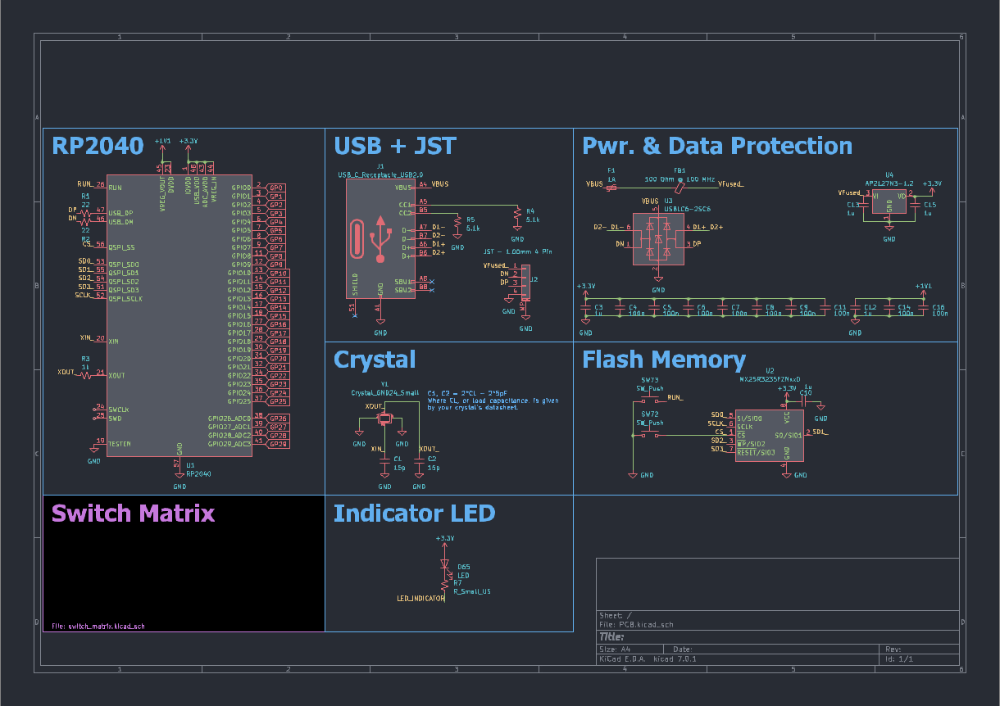

# Keyboard PCB Integration with Microcontrollers

This GitHub project provides guidance on integrating microcontrollers into keyboard PCBs. It focuses on the RP2040 microcontroller from the Raspberry Pi foundation, which offers several features such as a dual-core Arm Cortex-M0+ processor, multiple communication interfaces, and QMK/Via/Vial support.

## Schematic Capture

Before proceeding with board layout, it is important to understand the steps involved in schematic capture. The README provides an overview of the RP2040 microcontroller, including its integrated 3.3V->1.1V regulator, pin connections like TESTEN and RUN_, and the need for additional components such as decoupling capacitors.

## Power Supply and USB Bootloader

The RP2040 is powered through USB and features a built-in USB bootloader for easy programming. The README mentions the use of a 3.3V fixed regulator, USBLC6 ESD protection IC, PTC resettable fuse, and a ferrite bead for EMI suppression.

## PCB Connectors

The project includes information about the USB-C port, its orientation detection pins (CC1/CC2), and the 5.1k resistors used for USB power delivery. Additionally, a JST connector is introduced for use with a Unified Daughter Board.

## Crystal and External Flash

A crystal is employed to provide accurate timing for USB functionality. The README also covers the connections to the RP2040's external flash, including buttons for forcing the ROM bootloader and resetting the microcontroller.

## Indicator LED and Switch Matrix

An indicator LED example for caps lock indication is given, along with considerations for selecting an appropriate LED resistor value. The README highlights the use of diodes in the switch matrix to prevent "ghosting" and enable n-key rollover.
